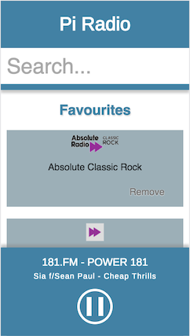

# Pi Radio



## Features

* Broadcasts controls over wifi network.
* Quick access to saved Favourites list.
* Search Other stations by name.
* 1000's of stations provided by external API.
* Plays via HDMI or 3.5mm jack.
* Works on all Pi's.
* Plug and play.
* Headless.
* Websockets for immediate updates.
* Built with Node.

## To run on Pi

```bash
git clone https://github.com/olmesm/pi-radio.git && cd pi-radio
scp -rp  private public config package.json  pi@pi-radio:~/pi-radio
pi$ npm run setup-pi

# the following will error - copy and paste the sudo command and then proceed
pi$ npm run pm2-setup
pi$ npm run pm2-first-run
```

Additionally requires:
* [Headless raspbian](https://github.com/olmesm/peepopi/blob/master/setup-pi.md)
* git (sudo apt-get install git)
* mplayer (sudo apt-get mplayer)
* [node & npm](https://github.com/olmesm/peepopi/blob/master/setup-node.md)
* [Nginx](https://github.com/olmesm/pi-radio/blob/master/walkthrough/Manage-serving-with-Nginx.md)
